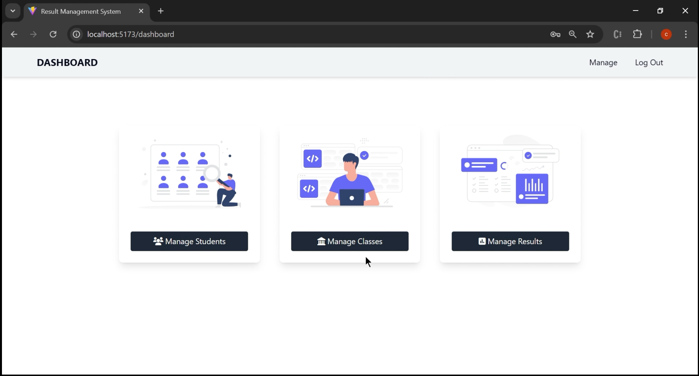

---

# Result Management System

## Table of Contents
- [About](#about)
- [Live Demo](#live-demo)
- [Features](#features)
- [Tech Stack](#tech-stack)
- [Screenshots](#screenshots)
- [Installation](#installation)
- [Usage](#usage)
- [Project Structure](#project-structure)
- [Contributors](#contributors)
- [License](#license)

---

## About
The **Result Management System** is a web application designed to manage and display student results in educational institutions. It simplifies student result management by streamlining the entire process—from managing classes and students to uploading and updating results. Built using the MERN stack, this platform ensures secure, efficient, and accurate result processing for both admins and students.

---

## Live Demo


---

## Features
- **Admin Panel**:
  - Secure login with JWT.
  - Manage different categories of marks (attendance, project reviews, assessments, etc.).
  - Upload Excel files to batch process student data.
  - Data validation to ensure accurate uploads.
- **Student Portal**:
  - Login with a unique ID to view marks.
  - View results across different categories.
  - Aggregate total marks for each student.
- **Data Management**:
  - MongoDB integration for storing and managing student data.
  - Efficient handling for data processing and retrieval.

---

## Tech Stack
- **Frontend**: React.js
- **Backend**: Node.js, Express.js
- **Database**: MongoDB
- **Authentication**: JWT (JSON Web Tokens)
- **Excel Integration**: Libraries such as `xlsx` or `exceljs`
- **Deployment**:
  - Frontend: Vercel
  - Backend: AWS EC2, Nginx
- **CI/CD**: GitHub Actions

---

## Screenshots



> Replace the links above with actual image URLs of the application screenshots.

---

## Installation

To set up the project locally, follow these steps:

### Prerequisites
- Node.js
- npm or Yarn
- MongoDB (Local or Remote)

### Backend Setup
1. Clone the repository:
   ```sh
   git clone [repository-url]
   ```
2. Navigate to the backend folder:
   ```sh
   cd backend
   ```
3. Install dependencies:
   ```sh
   npm install
   ```
4. Create a `.env` file with the following values:
   ```env
   MONGO_URI=your_mongodb_uri
   JWT_SECRET=your_jwt_secret
   PORT=8000
   ```
5. Start the backend server:
   ```sh
   npm start
   ```

### Frontend Setup
1. Navigate to the frontend folder:
   ```sh
   cd frontend
   ```
2. Install dependencies:
   ```sh
   npm install
   ```
3. Start the frontend server:
   ```sh
   npm run dev
   ```

---

## Usage
- **Admin**: Log in with admin credentials to manage classes, students, and results.
- **Students**: Use your unique ID to log in and view your results.

---

## Project Structure

### Backend
```
backend/
│
├── controllers/
│   ├── admin.controller.js
│   ├── dashboard.controller.js
│   ├── excelUpload.controller.js
│   └── result.controller.js
│
├── middlewares/
│   ├── isAuthenticated.js
│   └── multer.js
│
├── uploads/
│   ├── classexel.csv
│   ├── resultexel.csv
│   └── studentexel.csv
│
├── models/
│   ├── admin.model.js
│   ├── class.model.js
│   ├── result.model.js
│   └── student.model.js
│
├── routes/
│   ├── admin.route.js
│   ├── dashboard.route.js
│   ├── excelUpload.route.js
│   └── result.route.js
│
├── utils/
│   ├── cloudinary.js
│   ├── datauri.js
│   └── db.js
│
└── index.js
```

### Frontend
```
frontend/
│
├── assets/
│
├── components/
│   ├── admin.jsx
│   ├── AdminRegister.jsx
│   ├── dashboard.jsx
│   ├── ManageClasses.jsx
│   ├── ManageResult.jsx
│   ├── ManageStudents.jsx
│   ├── Student.jsx
│   └── StudentResult.jsx
│
├── components/partials/
│   └── navbar.jsx
│
├── lib/
│   └── utils.jsx
│
├── utils/
│   └── constant.jsx
│
├── app.jsx
└── main.jsx
```

---

## Contributors
- [Contributor 1 Name](https://github.com/contributor1)
- [Contributor 2 Name](https://github.com/contributor2)

---

## License
This project is licensed under the [MIT License](LICENSE).

---
